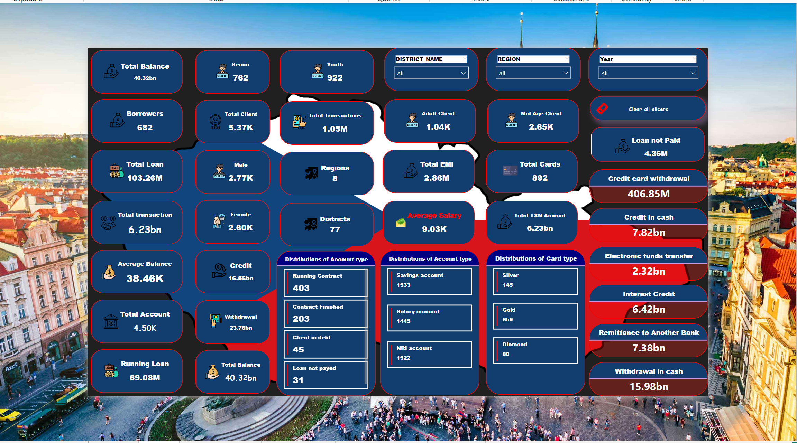
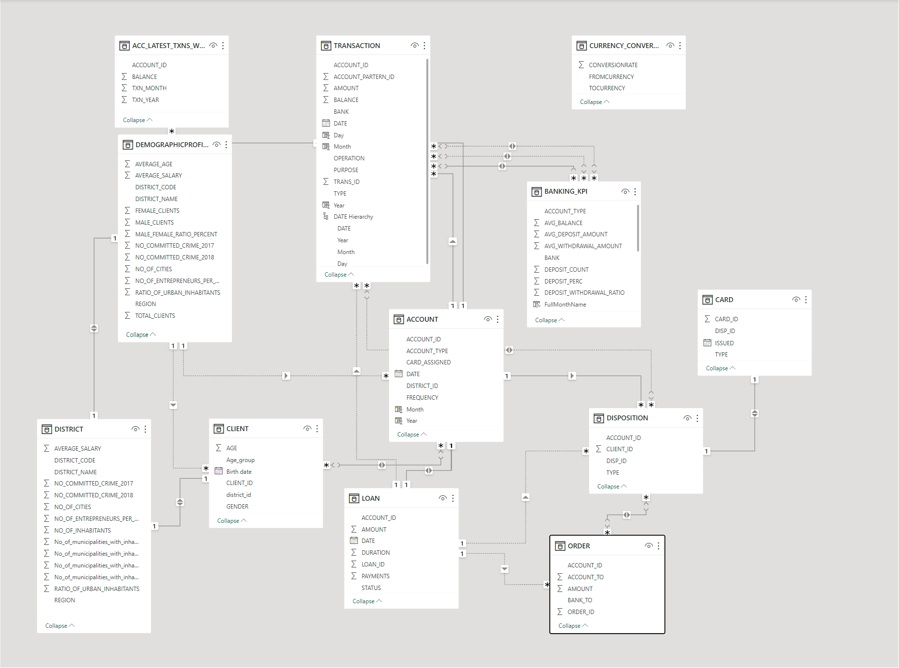
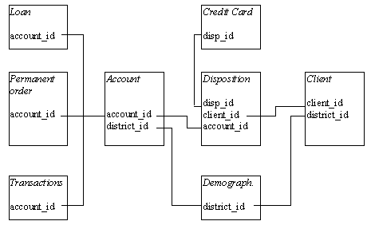
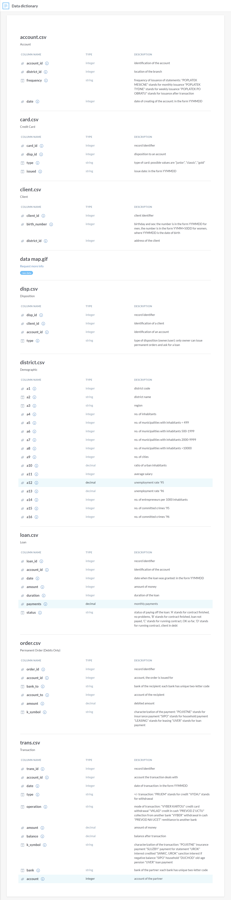
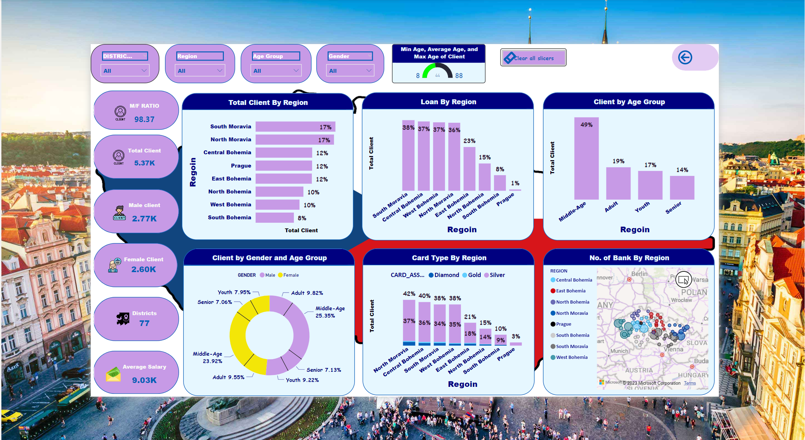
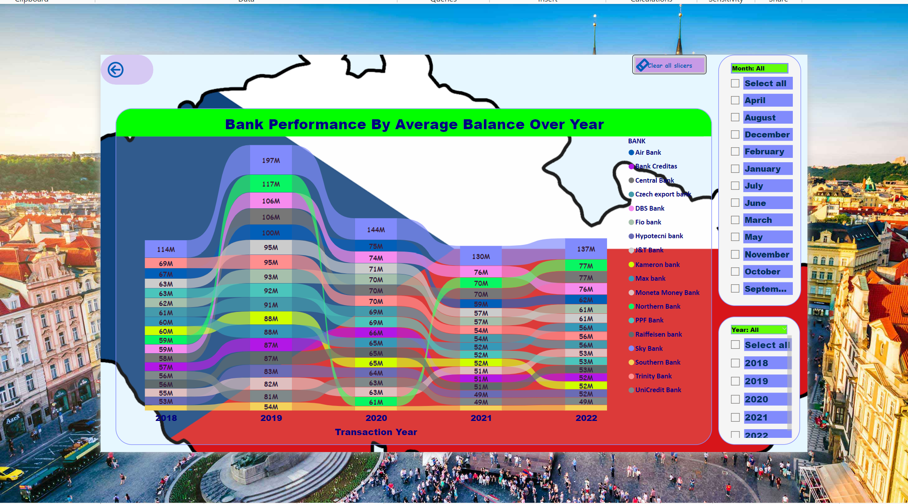
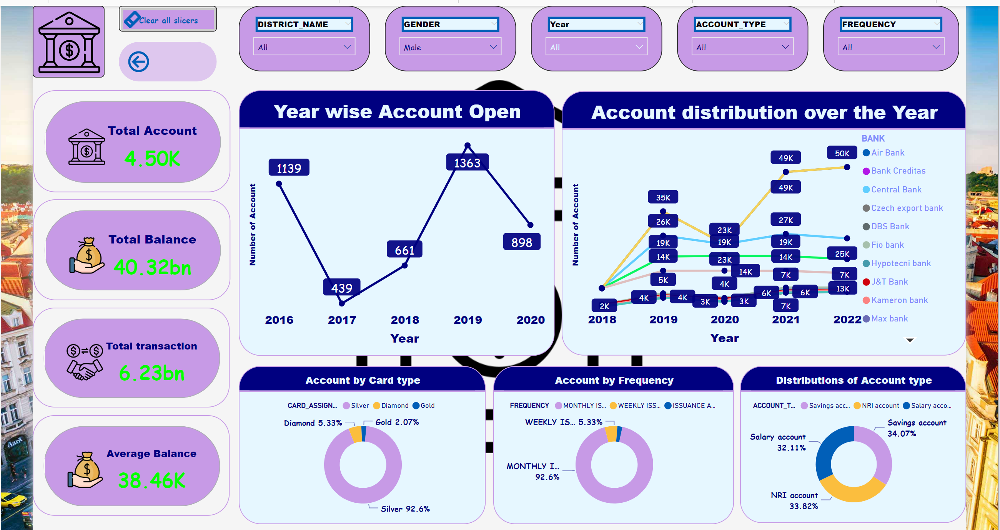
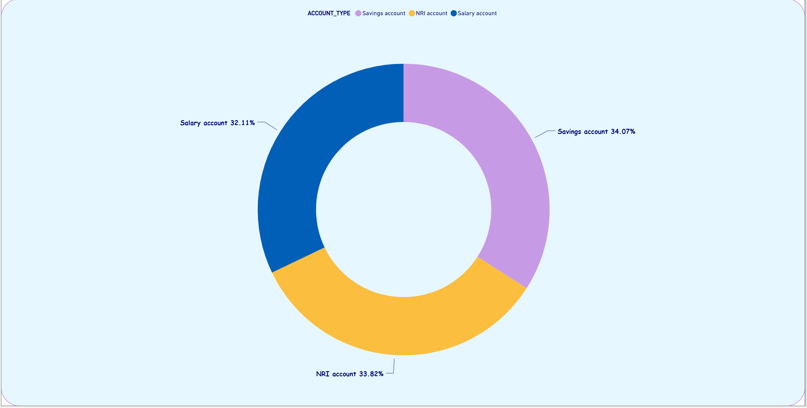

# Czechoslovakia-Banking-Data-Analysis

Hello everyone! 👋

I am excited to share my latest project work on end-to-end financial data analysis project using the Czechoslovakia Bank dataset📊. This project is a fully functional automated financial model, where clients can simply upload data in AWS ☁️, and the dashboard will update automatically in Power BI. 🚀

## Project Goal

**The bank wants to improve their services. For instance, the bank managers have only vague idea, who is a good client (whom to offer some additional services) and who is a bad client (whom to watch carefully to minimize the bank loses). Fortunately, the bank stores data about their clients, the accounts (transactions within several months), the loans already granted, the credit cards issued The bank managers hope to improve their understanding of customers and seek specific actions to improve services. A mere application of a discovery tool will not be convincing for them.**

- The Czechoslovakia Bank has provided a dataset containing information about its financial activities for the past 5 years. we need to provide insights on how can bank improve its customer service and satisfaction levels.
- Need to provide insights by analyzing the following tables - District, Account, Orders, Loan, Cards, Clients, Transactions and Disposition.
- The bank needs to identify trends, patterns, and potential risks in its financial operations. They also want to explore the possibility of introducing new financial products or services based on their analysis.

## Skill/Concepts 
This is fully functional automated Financial Model involved four major steps: 

Excel 📑 > AWS ☁️ > Snowflake 🔄 > Power BI 📊

### Microsoft Excel
- Basic Cleaning
- Change File Type To CSV

### AWS
- Bucket Creation In S3
- Role Assigning 
- Policy Creation 

### Snowflack
- Create Warehouses, Database, Schema, Table 
- Advance Data Cleaning 
- Storage Integration 
- File Format and Stage Creation
- Pipe-Line Creation
- Notification Alert Creation 
- Store Procedures Creation
- Task Creation 
- Alter And Call Task

### Power BI
- Build Connection and Extract Data 
- Transform Data
- Load Data
- Dashboard Creation

  

Overall, this project was a great learning experience, and I am proud to have completed such a complex project. If you have any questions about my project, please feel free to reach out to me. 😊

[Visit Here For more End to End Process](https://www.notion.so/End-To-End-Data-Analytics-Project-Czechoslovakia-Banking-Financial-Data-Analysis-79615e3aae6f4eff9e499971208f9388?showMoveTo=true)

## Domain Description

The dataset is a collection of financial information from a Czech bank. The dataset deals with over 5,300 bank clients with approximately 1,000,000 transactions. Additionally, the bank represented in the dataset has extended close to 700 loans and issued nearly 900 credit cards, all of which are represented in the data.

## Entity-Relationship Description

### Domain
- Each account has both static characteristics (e.g. date of creation, address of the branch) given in relation "account" and dynamic characteristics (e.g. payments debited or credited, balances) given in relations "permanent order" and "transaction".
Relation "client" describes characteristics of persons who can manipulate with the accounts.
One client can have more accounts, more clients can manipulate with single account; clients and accounts are related together in relation "disposition".

- Relations "loan" and "credit card" describe some services which the bank offers to its clients;
- More than one credit card can be issued to an account,
- At most one loan can be granted for an account.
- Relation "demographic data" gives some publicly available information about the districts (e.g. the unemployment rate); additional information about the clients can be deduced from this.
  
## Table Descriptions

### ACCOUNTS
- Each record describes static characteristics of an account
- Size: 4500 objects in the file

### CLIENTS
- Each record describes characteristics of a client
- Size : 5369 objects in the file

### DISPOSITON (DISP)
- Each record relates together a client with an account i.e. this relation describes the rights of clients to operate accounts
- Size: 5369 objects in the file

### PERMANENT ORDERS, Debits only (ORDER)
- Each record describes characteristics of a payment order
- Size : 6471 objects in the file

### TRANSACTIONS (TRANS)
- Each record describes one transaction on an account
- Size: 1056320 objects in the file

### LOANS
- Each record describes a loan granted for a given account
- Size: 682 objects in the file

### CREDIT CARDS (CARD)
- Each record describes a credit card issued to an account
- Size : 892 objects in the file

### DEMOGRAPHIC DATA (DISTRICT)
- Each record describes demographic characteristics of a district
- Size: 77 objects in the file

## Problem Statement 
The Czechoslovakia Bank wants to analyse its financial data to gain insights and make informed decisions. The bank needs to identify trends, patterns, and potential risks in its financial operations. They also want to explore the possibility of introducing new financial products or services based on their analysis.
The bank has identified the following questions as important for their analysis:
1. What is the demographic profile of the bank's clients and how does it vary across districts?
2. How the banks have performed over the years. Give their detailed analysis year & month-wise.
3. What are the most common types of accounts and how do they differ in terms of usage and profitability?
4. Which types of cards are most frequently used by the bank's clients and what is the overall profitability of the credit card business?
5. What are the major expenses of the bank and how can they be reduced to improve profitability?
6. What is the bank’s loan portfolio and how does it vary across different purposes and client segments?
7. How can the bank improve its customer service and satisfaction levels?
8. Can the bank introduce new financial products or services to attract more customers and increase profitability?
The objective of this analysis is to provide the Czechoslovakia Bank with actionable insights that can help them make informed decisions about their financial operations. The analysis will involve data cleaning, exploratory data analysis, and predictive modelling to identify patterns and trends in the data.

## Demographic profile of the bank's clients 

## Bank Performance By Average Balance Over Year

## Bank Account Type 

